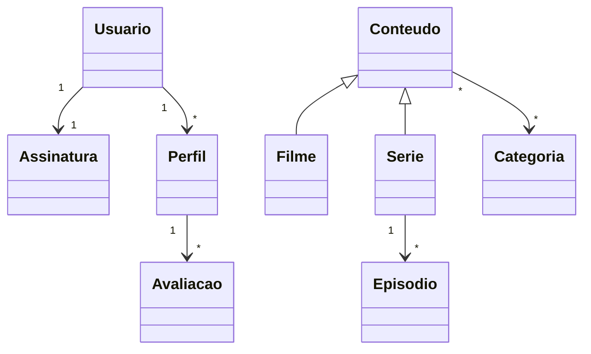

# Sistema de Streaming

## Dupla
- João Henrique 
- Pedro Lunkes

## Tema
Sistema de streaming similar ao Netflix, igual ao exemplo dado para a atividade.

## Relacionamentos
- **1:1** — Usuario e Assinatura
- **1:N** — Usuario e Perfil (bidirecional)
- **1:N** — Perfil e Avaliacao
- **1:N** — Serie e Episodio
- **N:M** — Conteudo e Categoria

## Estratégia de herança
JOINED — Conteudo é a classe pai, Filme e Serie são as subclasses. Cada uma tem sua própria tabela ligada por chave estrangeira.

## Diagrama Mermaid

